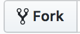

# JS-KATA

These are the exercises for the elective.

1.  Start by forking this repo to make it your own.
    

2.  Then clone it using something like `git clone https://github.com/yourgithubhandle/js-kata-fall-2018.git`

3.  Everytime we change the original repository you should do a pull from our repository to grab the latest version (merging them into your own).
    `git pull https://github.com/jofhatkea/js-kata-fall-2018.git`

## About the exercises

The exercises are structured into folders, each containing a README.md file and a folder called mysolution.

The only place you should add or change files, is in that folder

The easy way to read the `.md` file is by going to your repo at github.com

If you spot a spelling error or have something to add, please do a pull request :-)

## Suggested solutions

Suggested solutions for some of the katas will be posted at https://www.youtube.com/playlist?list=PLCx1FpZ4Dtb1cx9MFzRyHDtmiloBTGZy- a few days after the due date.
